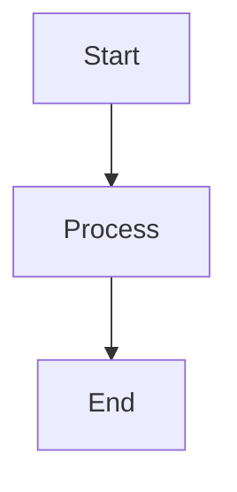

# Markdown Preview System

## Overview

The MarkItDown GUI features a sophisticated Markdown preview system with HTML rendering, syntax highlighting, extensions support, and advanced features.

## Features

### ✅ HTML Rendering
- **markdown-it-py**: High-quality Markdown to HTML conversion
- **Full HTML Documents**: Complete HTML with styles and scripts
- **Webview Support**: Native HTML rendering (tkinterweb)
- **Browser Fallback**: Opens in browser if webview unavailable

### ✅ Syntax Highlighting
- **Pygments**: Code syntax highlighting
- **Multiple Languages**: Support for all Pygments languages
- **Line Numbers**: Optional line number display
- **Code Wrapping**: Configurable code wrapping
- **Theme Support**: Light and dark code themes

### ✅ Markdown Extensions

#### Tables
- GitHub Flavored Markdown tables
- Automatic table formatting
- Responsive table styles

#### Footnotes
- Footnote support via plugin
- Automatic numbering
- Reference links

#### Task Lists
- Checkbox task lists
- Interactive checkboxes
- Styling support

#### Emoji
- Emoji support via plugin
- Unicode emoji rendering
- Emoji shortcuts

#### Math (KaTeX)
- Inline math: `$...$`
- Block math: `$$...$$`
- KaTeX rendering
- Math formula support

#### Mermaid Diagrams
- Mermaid diagram support
- Flowcharts, sequence diagrams
- Gantt charts, etc.

### ✅ Split View
- **Markdown | Preview**: Side-by-side view
- **Markdown Only**: Source editor only
- **Preview Only**: Preview only view
- **View Switching**: Easy mode switching

### ✅ Scroll Synchronization
- **Sync Scroll**: Synchronize scroll between source and preview
- **Toggle**: Enable/disable sync
- **Smooth Scrolling**: Smooth scroll behavior

### ✅ Presentation Mode
- **Fullscreen**: Fullscreen presentation
- **ESC to Exit**: Easy exit
- **Focus Mode**: Distraction-free viewing
- **Large Text**: Optimized for presentations

### ✅ Export Functionality
- **Export HTML**: Save rendered HTML
- **Export PDF**: Generate PDF from HTML (weasyprint)
- **Copy HTML**: Copy HTML to clipboard
- **Complete Documents**: Full HTML documents with styles

### ✅ Themes
- **GitHub**: GitHub-style theme
- **ReadTheDocs**: ReadTheDocs theme
- **GitHub Dark**: Dark GitHub theme
- **Minimal**: Minimal, clean theme
- **Custom**: Custom theme support

### ✅ Zoom
- **Zoom In/Out**: Adjust preview zoom
- **Zoom Range**: 50% to 200%
- **Zoom Display**: Current zoom percentage
- **Zoom Persistence**: Maintain zoom level

### ✅ Dark/Light Mode
- **Dark Mode**: Dark theme for preview
- **Light Mode**: Light theme for preview
- **Toggle**: Easy dark/light switching
- **Theme Integration**: Works with all themes

### ✅ Search
- **Search in Preview**: Find text in preview
- **Search Bar**: Dedicated search interface
- **Highlight Results**: Highlight search matches
- **Navigation**: Navigate between matches

### ✅ Copy HTML
- **Copy to Clipboard**: Copy rendered HTML
- **Complete HTML**: Full document HTML
- **Styles Included**: All CSS included
- **Ready to Use**: Paste-ready HTML

## Usage

### Basic Preview

```python
from gui.views.preview_window import MarkdownPreviewWindow

# Create preview window
window = MarkdownPreviewWindow(markdown_text="# Hello\n\nWorld!")
window.run()
```

### Using Renderer Directly

```python
from gui.core.markdown_renderer import MarkdownRenderer, RenderOptions, PreviewTheme

# Create renderer
options = RenderOptions(
    enable_tables=True,
    enable_math=True,
    enable_mermaid=True,
    theme=PreviewTheme.GITHUB,
    dark_mode=False,
)
renderer = MarkdownRenderer(options)

# Render markdown
html = renderer.render("# Hello\n\nWorld!")
```

### Split View

```python
from gui.components.markdown_preview import SplitPreviewView

# Create split view
split_view = SplitPreviewView(parent, renderer=renderer)
split_view.set_content(markdown_text)
```

### Export HTML

```python
# Export to file
renderer.export_html(markdown_text, Path("output.html"))
```

### Export PDF

```python
# Export to PDF (requires weasyprint)
renderer.export_pdf(markdown_text, Path("output.pdf"))
```

## Markdown Extensions

### Tables

```markdown
| Header 1 | Header 2 |
|----------|----------|
| Cell 1   | Cell 2   |
```

### Footnotes

```markdown
This is a footnote[^1].

[^1]: This is the footnote content.
```

### Task Lists

```markdown
- [ ] Task 1
- [x] Task 2 (completed)
- [ ] Task 3
```

### Emoji

```markdown
:smile: :heart: :rocket:
```

### Math

```markdown
Inline math: $E = mc^2$

Block math:
$$
\int_{-\infty}^{\infty} e^{-x^2} dx = \sqrt{\pi}
$$
```

### Mermaid Diagrams

````markdown

````

## Themes

### GitHub Theme
- Clean, modern design
- GitHub-style formatting
- Light background
- Professional appearance

### ReadTheDocs Theme
- Documentation-focused
- Blue accent colors
- Clean typography
- Professional docs style

### GitHub Dark Theme
- Dark background
- Light text
- GitHub dark style
- Easy on eyes

### Minimal Theme
- Simple, clean design
- Serif fonts
- Minimal styling
- Focus on content

## Configuration

### RenderOptions

```python
options = RenderOptions(
    enable_tables=True,        # Enable tables
    enable_footnotes=True,     # Enable footnotes
    enable_tasklists=True,     # Enable task lists
    enable_emoji=True,         # Enable emoji
    enable_math=True,          # Enable math (KaTeX)
    enable_mermaid=True,       # Enable Mermaid diagrams
    syntax_highlighting=True,  # Enable syntax highlighting
    theme=PreviewTheme.GITHUB, # Theme
    dark_mode=False,           # Dark mode
    zoom_level=1.0,           # Zoom level (0.5-2.0)
    line_numbers=False,        # Show line numbers
    wrap_code=True,            # Wrap code
)
```

## Integration

### With Conversion System

```python
from gui.models.conversion_model import ConversionModel
from gui.views.preview_window import show_preview

# Convert file
model = ConversionModel(event_bus)
result = model.convert(file_path)

# Show preview
show_preview(result.result_text)
```

### With Templates

```python
from gui.core.templates import TemplateManager
from gui.core.markdown_renderer import MarkdownRenderer

# Apply template
template = template_manager.get_template("technical_default")
rendered = template.render(content, metadata)

# Preview
show_preview(rendered)
```

## Keyboard Shortcuts

- **ESC**: Exit presentation mode
- **Ctrl+S**: Save markdown
- **Ctrl+O**: Open markdown
- **Ctrl+F**: Focus search

## Best Practices

1. **Use Extensions**: Enable needed extensions
2. **Choose Theme**: Select appropriate theme
3. **Dark Mode**: Use dark mode for long reading
4. **Export**: Export HTML for sharing
5. **Presentation**: Use presentation mode for demos
6. **Search**: Use search for long documents
7. **Zoom**: Adjust zoom for readability

## Troubleshooting

### HTML Not Rendering
- Check if tkinterweb is installed
- Browser fallback will be used
- Verify markdown-it-py installation

### Math Not Rendering
- Check KaTeX CDN availability
- Verify math syntax
- Check browser console for errors

### Mermaid Not Rendering
- Check Mermaid CDN availability
- Verify diagram syntax
- Check browser console

### PDF Export Fails
- Install weasyprint: `pip install weasyprint`
- Check file permissions
- Verify HTML rendering first

## Dependencies

- `markdown-it-py`: Markdown parsing
- `pygments`: Syntax highlighting
- `mdit-py-plugins`: Extensions
- `weasyprint`: PDF export (optional)
- `tkinterweb`: HTML rendering (optional)

## See Also

- [Markdown Renderer API](../core/markdown_renderer.py)
- [Preview Components](../components/markdown_preview.py)
- [Preview Window](../views/preview_window.py)
- [markdown-it-py Documentation](https://github.com/executablebooks/markdown-it-py)
- [Pygments Documentation](https://pygments.org/)

